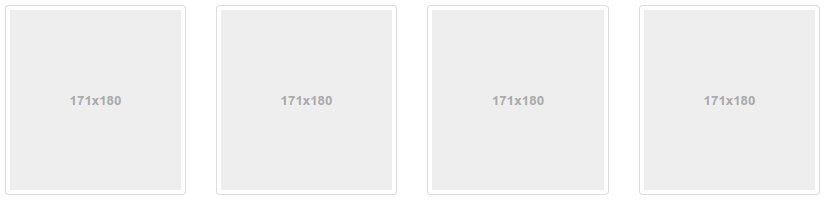

# What's new in Bootstrap 4

<!-- .slide: data-background="#563d7c" -->

Chih-Cheng Liang

---

# Notable Features

- Improved grid system <!-- .element: class="fragment" data-fragment-index="0" -->
- Dropped wells, thumbnails, and panels for cards <!-- .element: class="fragment" data-fragment-index="1" -->
-  <!-- .element: class="fragment" data-fragment-index="2" --> Switch from `px` to `em` and `rem`.
- And more... <!-- .element: class="fragment" data-fragment-index="3" -->
- see <!-- .element: class="fragment" data-fragment-index="4" -->

 http://blog.getbootstrap.com/2015/08/19/bootstrap-4-alpha/ <!-- .element: class="fragment" data-fragment-index="4" -->
- <!-- .element: class="fragment" data-fragment-index="5" --> Also  http://v4-alpha.getbootstrap.com/migration/

Note: em and rem https://j.eremy.net/confused-about-rem-and-em/

----

## Not so Notable Features

- Moved from Less to Sass <!-- .element: class="fragment" data-fragment-index="0" -->
- Dropped IE8 support and moved to rem and em units <!-- .element: class="fragment" data-fragment-index="1" -->
- Rewrote all our JavaScript plugins  <!-- .element: class="fragment" data-fragment-index="2" -->
- And more ... <!-- .element: class="fragment" data-fragment-index="3" -->

---

# Features

---

# A New Grid Tier XL

<table class="table table-bordered table-striped">
    <thead>
      <tr>
        <th></th>
        <th>
          Extra small
          <small>&lt;34em</small>
        </th>
        <th>
          Small
          <small>≥34em</small>
        </th>
        <th>
          Medium
          <small>≥48em</small>
        </th>
        <th>
          Large
          <small>≥62em</small>
        </th>
        <th  class="get-high fragment" data-fragment-index="0">
          Extra large
          <small>≥75em</small>
        </th>
      </tr>
    </thead>
    <tbody>
      <tr>
        <th class="text-nowrap" scope="row">width</th>
        <td>None (auto)</td>
        <td>34rem</td>
        <td>45rem</td>
        <td>60rem</td>
        <td class="fragment" data-fragment-index="0">72.25rem</td>
      </tr>
      <tr id="class-row">
        <th class="text-nowrap " scope="row" >Class</th>
        <td ><code>.col-xs-</code></td>
        <td><code>.col-sm-</code></td>
        <td><code>.col-md-</code></td>
        <td><code>.col-lg-</code></td>
        <td  class="get-high fragment" data-fragment-index="0"><code>.col-xl-</code></td>
      </tr>
    </tbody>
  </table>

Note: The widths are measured in rem

---

## Say goodbye to <strong class="higher">panels</strong>

<!-- .element: class="fragment " data-fragment-index="0" -->

----

## Say goodbye to <strong class="higher">thumbnails</strong>

<!-- .element: class="fragment" data-fragment-index="0" -->

----

## Say goodbye to <strong class="higher">wells</strong>

<!-- .element: class="fragment " data-fragment-index="1" -->

----

## Say goodbye to <strong class="higher">wells</strong>

----

# Card

<!-- <iframe data-src="http://localhost:3000/" height="500px" width="960px"></iframe> -->

Note: speaker notes FTW!

---

## Use Bootstrap 4 in Meteor

<pre style="font-size:1em">
<code class="sh" data-trim>
$ meteor add chuikoff:bootstrap-4
$ meteor add chuikoff:accounts-ui-bootstrap-4
</code>
</pre>
